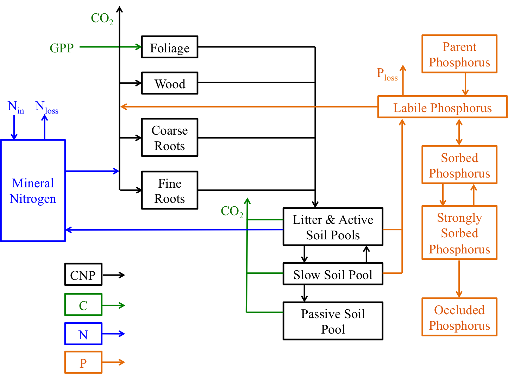

# GDAY model

GDAY (Generic Decomposition And Yield) is a simple ecosystem model that simulates carbon, nitrogen, and water dynamics at the stand scale (Comins and McMurtrie, 1993; Medlyn et al. 2000; Corbeels et al. 2005a,b).

The model can be run at either a daily time step, or a 30-minute time step. When the model is run at the sub-daily timescale, photosynthesis is calculated using a two-leaf (sunlit/shade) approximation (de Pury and Farquhar, 1997; Wang and Leuning, 1998), otherwise photosynthesis is calculated following Sands (1995;1996). The sub-daily approach (photosynthesis & leaf energy balance) mirrors [MAESPA](http://maespa.github.io/manual.html), without the complexity of the radiation treatment. In the standard model the water balance is represented simply, with two (fixed) soil water "buckets", which represent a top soil (e.g. 5 cm) and a larger root-zone. If you are using the sub-daily version, there is now the option to use a [SPA](http://www.geos.ed.ac.uk/homes/mwilliam/spa.html)-style representation of hydraulics. GDAY-SPA resolves multiple soil layers, soil and leaf water potential and limits gas exchange following the Emax approach (see [MAESPA](http://maespa.github.io/manual.html) for more details).

GDAY uses a modified version of the [CENTURY](https://www.nrel.colostate.edu/projects/century/) model to simulate soil carbon and nutrient dynamics (Parton et al. 1987; 1993).

<p style="text-align:center"></p>

## Installation
To get the code your best route is probably to fork the repository, there is a nice [explanation on github](https://help.github.com/articles/fork-a-repo/).

The model is coded entirely in C without any dependancies. The wrapper files
for the example scripts and the script used to change parameter options,
are written in python. The old python version is still [online](https://github.com/mdekauwe/pygday).

There is a Makefile in the src directory...

```bash
$ make clean ; make
```

The Makefile will need to be edited by hand to set the $ARCH flag, which sets the installation path. Currently it is hardwired to my computer.

## Running the model
A simple model usage can be displayed by calling GDAY as follows:

```bash
$ gday -u
```

Presently, there are only two options which the user can set via the command line. All model options, including *all* of the model parameters are customisable via the parameter file.

To spin-up GDAY:

```bash
$ gday -s -p param_file.cfg
```

To run GDAY:

```bash
$ gday -p param_file.cfg
```

When the model is run it expects to find its "model state" (i.e. from a previous spin-up) in the parameter file. This state is automatically written the parameter file after the initial spin-up when the "print_options" flag has been set to "end", rather than "daily".


## Parameter file

GDAY expects a parameter file to be supplied as an argument (-p filename) on the command line. Parameter files follow the standard [.INI](https://en.wikipedia.org/wiki/INI_file) format, although only a simple INI parser has been coded into GDAY.

Parameter files are broken down into 6 section, namely [git], [files], [params], [control], [state] and [print]. The order of these sections shouldn't make any difference. The basic element contained in the parameter file is the key or property. Every key has a name and a value, delimited by an equals sign (=). The name appears to the left of the equals sign.

```ini
eac = 79430.0
```

As mentioned above, keys are grouped into sections:

```ini
[control]
alloc_model = allometric
deciduous_model = false
```

or

```ini
[files]
cfg_fname = params/NCEAS_DUKE_model_youngforest_amb.cfg
met_fname = met_data/DUKE_met_data_amb_co2.csv
out_fname = outputs/D1GDAYDUKEAMB.csv
out_param_fname = params/NCEAS_DUKE_model_simulation_amb.cfg
```

As all the model parameters are accessible via this file, these files can be quite long. Clearly it isn't necessary to list every parameter. The recommended approach is to use the [base file](example/params/base_start.cfg) and then customise whichever parameters are required via a shell script, e.g. see the python [wrapper script](example/example.py). This file just lists the parameters which needs to be changed and calls [adjust_gday_param_file.py](scripts/adjust_gday_param_file.py) to swap the parameters (listed as a python dictionary) with the default parameter. I have also written an equivalent version in R [adjust_gday_param_file.R](scripts/adjust_gday_param_file.R). I should highlight that I wouldn't necessarily trust the default values :).

Finally, the options to print different the state and flux variables on the fly is a nice hangover from the python implementation. Sadly, this functionality doesn't actually exist in the C code, instead all the state and flux variables used in the FACE intercomparisons are dumped as standard.

When I have time I will write something more extensive (ha), but information about what different variable names refer to are listed in the [header file](src/include/structures.h), which documents the different structures (i.e. control, state, params).

The git hash allows you to connect which version of the model code produced which version of the model output. I'd argue for maintaining this functionality, but if you don't use git or wish to ignore me, filling this line with gibberish and disabling the shell command in the Makefile should allow you to do this.

## Potential gotchas
- The parameter alpha_j which represents the quantum yield of electron transport (mol mol-1) is the intrinsic quantum yield (i.e. per unit APAR). For the two-leaf version of the model, alpha_j should be divided by (1.0 - omega), where omega is the leaf scattering coefficient of PAR (leaf reflectance and transmittance combined). Currently we are assuming omega = 0.15 (radiation.c), this is currently hardwired.

- The deciduous phenology scheme does not currently work with the two-leaf version of the model (can be fixed).

## Meteorological driving file

**30-minute file:**

Variable | Description | Units
--- | --- | ---
year | |
doy  | day of year  | [1-365/6]
hod  | hour of day  | [0-47]
rain | rainfall | mm 30 min<sup>-1</sup>
par | photosynthetically active radiation | umol m<sup>-2</sup> s<sup>-1</sup>
tair | air temperature | deg C
tsoil | soil temperature | deg C
vpd | vapour pressure deficit | kPa
co2 | CO<sub>2</sub> concentration | ppm
ndep | nitrogen deposition | t ha<sup>-1</sup> 30 min<sup>-1</sup>
nfix | biological nitrogen fixation | t ha<sup>-1</sup> 30 min<sup>-1</sup>
wind | wind speed | m s<sup>-1</sup>
press | atmospheric pressure | kPa


**Day file:**

Variable | Description | Units
--- | --- | ---
year | |
doy  | day of year  | [0-365/6]
tair | (daylight) air temperature | deg C
rain | rainfall | mm day<sup>-1</sup>
tsoil | soil temperature | deg C
tam | morning air temperature | deg C
tpm | afternoon air temperature | deg C
tmin | minimum (day) air temperature | deg C
tmax | minimum (day) air temperature | deg C
tday | day average air temperature (24 hrs) | deg C
vpd_am | morning vapour pressure deficit | kPa
vpd_pm | afternoon vapour pressure deficit | kPa
co2 | CO<sub>2</sub> concentration | ppm
ndep | nitrogen deposition | t ha<sup>-1</sup> day<sup>-1</sup>
nfix | biological nitrogen fixation | t ha<sup>-1</sup> day<sup>-1</sup>
wind | wind speed | m s<sup>-1</sup>
press | atmospheric pressure | kPa
wind_am | morning wind speed | m s<sup>-1</sup>
wind_pm | afternoon wind speed | m s<sup>-1</sup>
par_am | morning photosynthetically active radiation | MJ m<sup>-2</sup> d<sup>-1</sup>
par_am | afternoon photosynthetically active radiation | MJ m<sup>-2</sup> d<sup>-1</sup>

## Nitrogen inputs
Nitrogen (N) entering the system via biological N fixation (BNF; tonnes ha<sup>-1</sup> yr<sup>-1</sup>) and N deposition (tonnes ha<sup>-1</sup> yr<sup>-1</sup>) are prescribed and passed via the met file. If information isn't available from the experiment GDAY is being applied to, BNF can be calculated as a function of evapotranspiration (ET) based on Cleveland et al. 1999.

Following Smith et al. (2014), Biogeosciences and Wieder et al. (2015), ERL,
we also suggest the conservation BNF equation (Fig. 1). For estimates of ET you can either use values by PFT based on Table 1 in Cleveland or use the sum of canopy evaporation and transpiration. Wieder et al (pg 3) argued that using total ET leads to a high bias in BNF estimates in arid regions.

BNF (kg N ha-1 yr-1) is then calculated as a function of ET:

```python
BNF = 0.102 * (ET * mm_2_cm) + 0.524
```

## Hydraulics
From SPA we borrow the multi-layer soil scheme, which considers infiltration and drainage between layers. We also implement the soil-to-leaf hydraulics from SPA, which includes weighting soil water potential. We limit gas exchange following the Emax approach (Duursma et al. 2008).

We do not currently implement the thermal calculations which would allow you to estimate soil temperature.


## Example run
The [example](example) directory has two python scripts which provide an example of how one might set about running the model. [example.py](example.py) simulates the DUKE FACE experiment and [run_experiment.py](run_experiment.py) is just nice a wrapper script around this which produces a plot at the end comparing the data to the observations.

```bash
cd example/
python run_experiment.py
```

This should pop a plot of NPP, LAI and transpiration onto your screen. This example tends to break from time to time when I change various options, so please let me know if it isn't working!

**NB** to use this wrapper script you will need to have an installation of the [Pandas](http://pandas.pydata.org/) and [Matplotlib](http://matplotlib.org/) libraries installed. If you are a python user this is fairly standard.


## Key References
1. Comins, H. N. and McMurtrie, R. E. (1993) Long-Term Response of Nutrient-Limited Forests to CO2 Enrichment; Equilibrium Behavior of Plant-Soil Models. *Ecological Applications*, 3, 666-681.
2. Medlyn, B. E., McMurtrie, R. E., Dewar, R. C. and Jeffreys, M. P. (2000), Soil processes dominate the long-term response of forest net primary productivity to increased temperature and atmospheric CO2 concentration, *Canadian Journal of Forest Research*, 30, 873–888.
3. Corbeels M, McMurtrie RE, Pepper DA, O’Connell AM (2005a) A process-based model for nitrogen cycling in forest planta- tions Part I. Structure, calibration and analysis of decomposi- tion model. Ecological Modelling, 187, 426–448.
4. Corbeels M, McMurtrie RE, Pepper DA, O’Connell AM (2005b) A process-based model for nitrogen cycling in forest planta- tions Part II. Simulating growth and nitrogen mineralisation of Eucalyptus globulus plantations in south-western Australia. Ecological Modelling, 187, 449–474.
5. Sands PJ (1995) Modelling canopy production. II. From single-leaf photosynthetic parameters to daily canopy photosynthesis. Australian Journal of *Plant Physiology*, 22, 603-614.
6. Sands PJ (1996) Modelling canopy production. III. Canopy light-utilisation efficiency and its sensitivity to physiological environmental variables. *Australian Journal of Plant Physiology*, 23, 103-114.
7. de Pury, D.G.G., Farquhar, G.D. (1997) Simple scaling
of photosynthesis from leaves to canopies without the errors of big-leaf models. *Plant, Cell and Environment*, 20, 537-557.
8. Wang, Y-P. and Leuning R. (1998) A two-leaf model for canopy conductance, photosynthesis and portioning of available energy I: Model description and comparison with a multi-layered model. *Agricultural and Forest Meteorology*, 91, 89–111.
9. Parton, W.J., Schimel, D.S., Cole, C.V., and Ojima, D.S. (1987) Analysis of factors controlling soil organic matter levels in Great Plains grasslands. Soil Sc. Soc. Am. J. 51: 1173–1179.
10. Parton, W.J., Scurlock, J.M.O., Ojima, D.S., Gilmanov, T.G., Scholes, R.J., Schimel, D.S., Kirchner, T., Menaut, J.-C., Seastedt, T., Garcia Moya, E. Kamnalrut, A., and Kinyamario, J.I. (1993) Observations and modeling of biomass and soil or- ganic matter dynamics for the grassland biome worldwide. Global Biogeochem. Cycles, 7: 785–809.
11. Duursma, RA and Kolari, P and Perämäki, M and Nikinmaa, E and Hari, P and Delzon, S and Loustau, D and Ilvesniemi, H and Pumpanen, J and Mäkelä, A. (2008) Predicting the decline in daily maximum transpiration rate of two pine stands during drought based on constant minimum leaf water potential and plant hydraulic conductance. Tree physiology, 28, 265-276.
12. Duusma, R. A. and Medlyn, B. E. (2012) MAESPA: a model to study interactions between water limitation, environmental drivers and vegetation function at tree and stand levels, with an example application to [CO2] x drought interactions. Geoscientific Model Development, 5, 919-940.


## Contacts
* [Martin De Kauwe](http://mdekauwe.github.io/).
* [Belinda Medlyn](<http://bio.mq.edu.au/people/person.php?user=bmedlyn).
